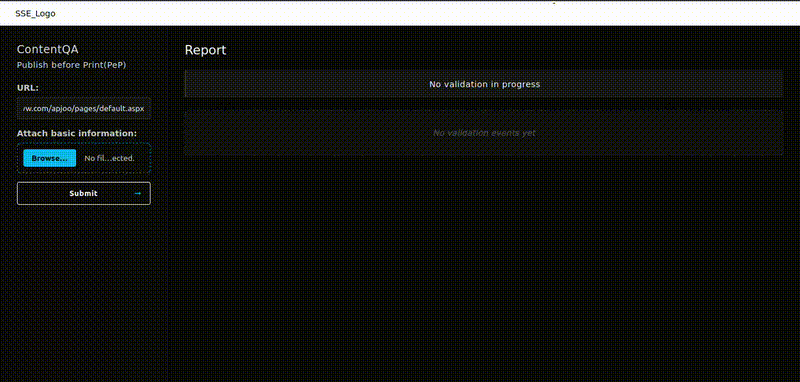

# SSE(Server Sent Event)

A real-time document validation system using FastAPI and Server-Sent Events (SSE).

---

## DEMO


## 🛠️ Technology Stack

- **Frontend**: HTML5, CSS3, JavaScript (vanilla)
- **Backend**: FastAPI (Python)
- **Communication**: Server-Sent Events (SSE) for real-time updates
---


## 📦 Installation

### Prerequisites

- Python 3.8+
- Node.js and npm *(optional, for development tools)*

### Setup

1. **Clone the repository:**

   ```bash
   git clone https://github.com/Im-Alam/server_sent_event.git
   cd server_sent_event.git

2. **🔧Create and activate a virtual environment:**

    ```bash
    python -m venv venv
    source venv/bin/activate  # On Windows: venv\Scripts\activate

3. **Install dependencies**
    ```bash
    pip install -r requirements.txt

4. **Run the application**
    ```bash
    uvicorn app:app --reload

5. **Open the index.html in browser**
    ```bash
    python -m http.server 8080
    <!-- Or Go to the folder and doubble click the html file -->

6. **Running**
    Upload a link in url box and submit to see the magic